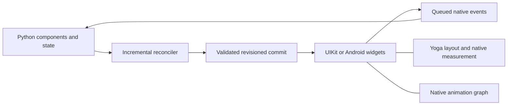

# Architecture

PythonNative renders ordinary Python function components into native UIKit and
Android widgets. A single logical tree connects the application root, providers,
screens, overlays, and visible list rows.

## Execution and ownership

`runtime.py` owns a standard asyncio application loop on a dedicated thread.
Components, effects, and callbacks execute there. Component task scopes cancel
work on unmount. Application services can own longer-lived task scopes.
Blocking Python work delays application callbacks, so applications should use
ordinary asyncio APIs and explicitly move blocking I/O off the application loop.

The reconciler maintains stable keyed instances, parent relationships, native
tag indexes, dirty component work, and pending effects. Updating a child preserves
its ancestors and siblings unless their own inputs or context change. Native
child relationships are rebuilt when a component's native roots change.
Effects run after committed views exist, with child effects preceding parents.

Equality accepts identity and scalar Boolean comparisons. Array-like comparisons
that produce another array aren't coerced to a Boolean. Mutable objects must be
replaced to signal a state or dependency change. Frozen dataclasses are a good
choice for shared snapshots.

## Native presentation

Swift and Kotlin component managers create widgets, apply props, measure native
content, handle commands, and release resources. Yoga owns geometry. The platform
UI thread owns every widget mutation and input callback. The bridge releases
Python's execution lock while native applies synchronous requests.

Navigation presents logical screen roots through a nested UIKit navigation
controller or Android fragments. Pushing a screen doesn't create another Python
application root. Providers and repositories above the navigator remain shared;
covered screens retain their component state. Native lifecycle restoration uses
the latest cached Python navigation state.

Virtualized lists keep row state in ordinary keyed components and mount a bounded
window. Native collection and recycler views request rows asynchronously by
key, index, and data revision. Measured heights replace estimates. Headers,
footers, empty states, grouped grids, and sections use the same ownership model.

## Contracts and tooling

Protocol 2 validates commits before mutation and acknowledges exact revisions.
Events carry application and revision identities. Controlled inputs additionally
acknowledge native edit revisions to avoid overwriting newer typing. Native
animation graphs perform frame updates independently of Python callbacks.

The SDK compiles dataclass props and protocol methods into portable contracts.
Generated artifacts are checked in and tested for drift. Target-wheel plugin
metadata is read as data, without importing a mobile binary on the development
machine. Resources and registration code are staged into the native libraries.

`pn deps --lock` records target-specific wheel versions, URLs, and SHA-256 hashes.
Builds reject stale locks and missing targets. Wheel tag compatibility and native
SDK compatibility remain separate checks; a lock doesn't prove an extension can
run on a device. Test every supported deployment target.

Fast Refresh preserves compatible component state. Changes to hook order or
custom-hook signatures remount affected instances. Changes to helper classes or
services remount the application to avoid retaining instances of old definitions.
Native contract changes require rebuilding the dev client.

Python phase timings and bridge work counters can be captured in Chrome trace
format. See [Profiling](../guides/dev-workflow.md#profiling) for collection and
export instructions.

## Runtime limits

The application host uses one surface. A failed bridge commit requires a
complete surface reset and remount; see [Commits](bridge.md#commits).
Reconciliation reduces work at dirty component roots but doesn't time-slice
arbitrary Python render functions. Long computations delay Python callbacks
and commits even while native scrolling and animation drivers continue.
Use cooperative async work, move blocking I/O off the application thread,
and keep expensive computation out of render functions.

Shared layout rules don't imply identical fonts or control sizes. Test
intrinsic measurement, accessibility, and performance on your deployment
targets. Simulator and emulator tests exercise app behavior; they don't
validate device signing, store submission, or performance on physical devices.

## Source map

| Area | Location under `src/pythonnative` |
| --- | --- |
| Components and lifetimes | `component.py`, `hooks.py`, `runtime.py` |
| Reconciliation | `reconciler/`, `mutations.py`, `events.py` |
| Bridge protocol | `bridge/`, `native_views/bridge_backend.py` |
| Native renderers | `native/ios/`, `native/android/` |
| Shared layout core | `native/yoga/`, `layout.py` |
| Navigation and lists | `navigation/`, `components/lists.py` |
| Animation graphs | `animated.py`, `animation_graph.py` |
| Contracts and plugins | `sdk/`, `project/plugins.py` |
| Build and dependency locks | `project/`, `cli/` |
| Browser preview | `preview.py`, `devserver/static/` |

The [Inbox example](../examples.md#complete-apps) combines shared providers,
variable-height rows, cancellable search, forms, persistence, native navigation,
and a generated native extension.
