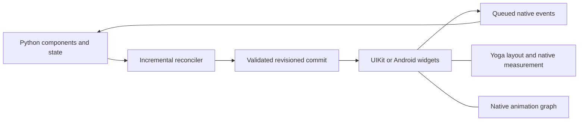

# Architecture

PythonNative renders ordinary Python function components into native UIKit and
Android widgets. A single logical tree connects the application root, providers,
screens, overlays, and visible list rows.

```mermaid
flowchart LR
    A[Python components and state] --> B[Incremental reconciler]
    B --> C[Validated revisioned commit]
    C --> D[UIKit or Android widgets]
    D --> E[Queued native events]
    E --> A
    D --- F[Yoga layout and native measurement]
    D --- G[Native animation graph]
```

## The authoring model

Application code is ordinary, typed Python. Components are functions
whose signatures are their prop lists, and they return a
[`pn.Node`][pythonnative.element.Node], so a strict type checker
verifies element trees, props, and conditional children. Screens are
components whose parameters are their route params, and navigators are
module-level values (see [Navigation](../guides/navigation.md)). One
[`Theme`][pythonnative.Theme] styles both the app and its navigators,
[`StyleSheet`][pythonnative.StyleSheet] namespaces give styles typed
names, and a [`Store`][pythonnative.Store] holds app state outside the
tree. `pn lint` checks the rules of hooks statically.

Run-time validation is a development aid. Built-in prop and style
validation, and checks of user component props against their
annotations, run only in development builds and under the pytest
plugin. Release builds skip them and omit development-only modules
(the CLI, dev server, Fast Refresh, browser preview, SDK code
generators, and testing library) from the bundle.

## Execution and ownership

`runtime.py` owns a standard asyncio application loop on a dedicated thread.
Components, effects, and callbacks execute there. Component task scopes cancel
work on unmount. Application services can own longer-lived task scopes.
Blocking Python work delays application callbacks, so applications should use
ordinary asyncio APIs and explicitly move blocking I/O off the application loop.

The reconciler maintains stable keyed instances, parent relationships, native
tag indexes, dirty component work, and pending effects. Updating a child preserves
its ancestors and siblings unless their own inputs or context change. A child
element that's the identical object from the previous render is skipped with
its subtree, and a changed context value marks only the consumers recorded in
its provider's registry (see [Reconciliation](reconciliation.md#skipping-unchanged-subtrees)). Native
child relationships are rebuilt when a component's native roots change.
Effects run after committed views exist, with child effects preceding parents.
Renders are batched automatically: setter calls made in one callback, effect,
or task step coalesce into one flush on the application loop. An effect that
raises is routed to the nearest error boundary like a render error, and a
component that re-dirties itself for more than fifty passes raises
`RuntimeError("Too many re-renders")` through the same path.

Equality accepts identity and scalar Boolean comparisons. Array-like comparisons
that produce another array aren't coerced to a Boolean. Bound methods compare
equal when they wrap the same function on the same object, so passing
`service.subscribe` as a dependency or prop doesn't count as a change. Mutable
objects must be replaced to signal a state or dependency change. Frozen
dataclasses are a good choice for shared snapshots and
[`Store`][pythonnative.Store] values.

## Native presentation

Swift and Kotlin component managers create widgets, apply props, measure native
content, handle commands, and release resources. Yoga owns geometry. The platform
UI thread owns every widget mutation and input callback. A worker performs the
blocking native commit crossing while the application
loop remains available for input and asyncio tasks. One transaction mounts at a
time; queued transactions prepare against the latest acknowledged revision.
Refs, effects, and queued native events publish after acknowledgement. State
writes during mounting coalesce into the following render.

Navigation presents logical screen roots through a nested UIKit navigation
controller or Android fragments. Pushing a screen doesn't create another Python
application root. Providers and repositories above the navigator remain shared;
covered screens retain their component state. Native lifecycle restoration uses
the latest cached Python navigation state.

Virtualized lists keep row state in ordinary keyed components and mount a bounded
window. Native collection and recycler views request rows asynchronously by
key, index, and data revision. Measured heights replace estimates. Headers,
footers, empty states, grouped grids, and sections use the same ownership model.

## Contracts and tooling

Protocol 4 validates commits before mutation and acknowledges exact revisions.
Events carry application and revision identities. Controlled inputs additionally
acknowledge native edit revisions to avoid overwriting newer typing. Native
animation graphs perform frame updates independently of Python callbacks.

The SDK compiles dataclass props and protocol methods into portable contracts
and executable Swift/Kotlin predicates. Native prop wrappers cache decoded
fields. Yoga applies touched styles directly and returns geometry only for
observed refs and layout callbacks. `ListData` feeds revisioned keyed patches;
ordinary sequences use a scanning adapter to that same protocol.
Generated artifacts are checked in and tested for drift. Target-wheel plugin
metadata is read as data, without importing a mobile binary on the development
machine. Resources and registration code are staged into the native libraries.

`pn deps --lock` records target-specific wheel versions, URLs, and SHA-256 hashes.
Builds reject stale locks and missing targets. Wheel tag compatibility and native
SDK compatibility remain separate checks; a lock doesn't prove an extension can
run on a device. Test every supported deployment target.

Fast Refresh preserves compatible component state. Changes to hook order or
custom-hook signatures remount affected instances. Removing a class or changing
its definition remounts the application to avoid retaining instances of the old
definition; functions, `TypedDict`s, `Protocol`s, and unchanged classes don't.
Native contract changes require rebuilding the dev client. Development errors
use a host-owned overlay with a traceback and reload/dismiss controls. It can
report a poisoned renderer and reload a fresh surface without rendering an
additional Python error tree.

Python phase timings and bridge work counters can be captured in Chrome trace
format. See [Profiling](../guides/dev-workflow.md#profiling) for collection and
export instructions.

## Runtime limits

The application host uses one surface. A failed bridge commit requires a
complete surface reset and remount; see [Commits](bridge.md#commits).
Reconciliation reduces work at dirty component roots but doesn't time-slice
arbitrary Python render functions. Long computations delay Python callbacks
and commits even while native scrolling and animation drivers continue.
Use cooperative async work, move blocking I/O off the application thread,
and keep expensive computation out of render functions.

Shared layout rules don't imply identical fonts or control sizes. Test
intrinsic measurement, accessibility, and performance on your deployment
targets. Simulator and emulator tests exercise app behavior; they don't
validate device signing, store submission, or performance on physical devices.

## Source map

| Area | Location under `src/pythonnative` |
| --- | --- |
| Components and lifetimes | `component.py`, `element.py`, `hooks.py`, `runtime.py` |
| Styles, themes, and stores | `style.py`, `theme.py`, `store.py` |
| Props and dev-mode checks | `components/props.py`, `prop_checks.py`, `diagnostics.py` |
| Rules-of-hooks linter | `lint.py` |
| Reconciliation | `reconciler/`, `mutations.py`, `events.py` |
| Bridge protocol | `bridge/`, `native_views/bridge_backend.py` |
| Imperative handles and undo journal | `handles.py`, `journal.py` |
| Native renderers | `native/ios/`, `native/android/` |
| Shared layout core | `native/yoga/`, `layout.py` |
| Navigation and lists | `navigation/`, `components/lists.py` |
| Animation graphs | `animated.py`, `animation_graph.py` |
| Contracts and plugins | `sdk/`, `project/plugins.py` |
| Device modules | `native_modules/` |
| Testing library and pytest plugin | `testing/` |
| Build and dependency locks | `project/`, `cli/` |
| Browser preview | `preview.py`, `devserver/static/` |

The [Inbox example](../examples.md#complete-apps) combines shared providers,
variable-height rows, cancellable search, forms, persistence, native navigation,
and a generated native extension.
