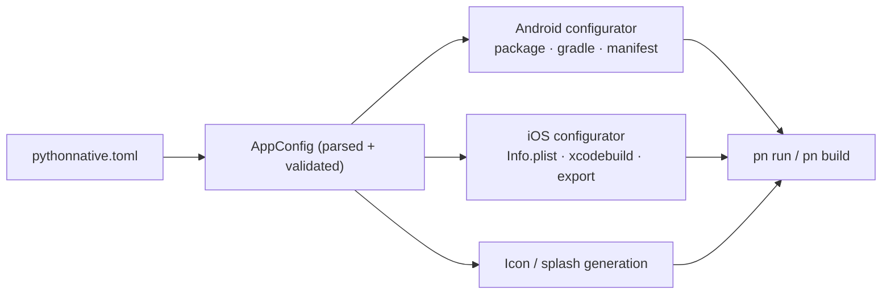

# Configuration (`pythonnative.toml`)

Every PythonNative project is described by a single `pythonnative.toml`
file at its root. It is the one source of truth for your app's
**identity** (bundle/application id, name, version), the **device
permissions** it requests, its **icon and splash**, the **packages** it
bundles, and **signing**. `pn init` scaffolds one for you, and every
other command (`pn run`, `pn build`, `pn doctor`, `pn app-id`) reads it.

```toml
[app]
id = "com.example.myapp"        # reverse-DNS id (required)
name = "myapp"                  # short project name (required)
display_name = "My App"         # home-screen label (defaults to name)
version = "1.0.0"               # marketing version
build = 1                       # integer build number
python_version = "3.13"         # embedded CPython version (3.13 or 3.14)
orientation = "portrait"        # portrait | landscape | all
entry_point = "app/main.py"     # module whose `App` is mounted
url_schemes = ["myapp"]         # deep-link schemes the app handles

[permissions]
camera = "Scan receipts with your camera."
location_when_in_use = "Show nearby stores."
notifications = true

[assets]
icon = "assets/icon.png"        # 1024x1024 source icon
splash = "assets/splash.png"    # splash / launch image

[requirements]
packages = ["humanize", "httpx", "numpy"]
# extra_index_urls = ["https://wheels.example.com/simple"]

[plugins]
# paths = ["native/my_plugin"]  # project-local Swift/Kotlin plugins

[ios]
deployment_target = "13.0"
development_team = "ABCDE12345"
# bundle_id = "com.example.myapp"

[ios.signing]
export_method = "development"   # development | ad-hoc | app-store | enterprise
# provisioning_profile = "My App Distribution"

[android]
min_sdk = 24
target_sdk = 34
# abi_filters = ["arm64-v8a", "x86_64"]   # the default; add 32-bit ABIs if needed

[android.signing]
# keystore = "release.keystore"
# key_alias = "myapp"
```

Paths (icon, splash, keystore) are resolved relative to the project
root. Invalid configuration fails fast with a specific, actionable
error; run [`pn doctor`](../api/cli.md) to validate at any time.

---

## `[app]`

Core identity, shared by both platforms.

| Key | Type | Default | Notes |
| --- | --- | --- | --- |
| `id` | string | **required** | Reverse-DNS id with at least two segments, e.g. `com.example.myapp`. Each segment must be lowercase, start with a letter, and avoid Java/Kotlin reserved words. Becomes the default Android application id and iOS bundle id. |
| `name` | string | **required** | Short project name. Used for the Gradle/Xcode project name and as the default `display_name`. |
| `display_name` | string | `name` | The label shown under the icon on the home screen. |
| `version` | string | `"1.0.0"` | Marketing version (`CFBundleShortVersionString` / `versionName`). One to four dot-separated numbers. |
| `build` | integer | `1` | Build number (`CFBundleVersion` / `versionCode`). Must be a positive integer; bump it for every store upload. |
| `python_version` | string | `"3.13"` | Embedded CPython version. One of `3.13`, `3.14`; every listed version has a pinned, checksum-verified iOS runtime and a matching Chaquopy build. Packages are resolved for this version, not your host's (see [PyPI packages](pypi-packages.md)). |
| `orientation` | string | `"portrait"` | `portrait`, `landscape`, or `all`. |
| `url_schemes` | list of strings | `[]` | Custom deep-link URL schemes (e.g. `["myapp"]` handles `myapp://…`). Wired into `CFBundleURLTypes` on iOS and a `VIEW` intent filter on Android; inbound URLs reach `pn.Linking`. |
| `entry_point` | string | `"app/main.py"` | The module whose top-level `App` component is mounted. `app/main.py` → imported as `app.main`. |

!!! tip "Per-platform id overrides"
    By default both platforms use `app.id`. To diverge, set
    [`[android].application_id`](#android) and/or
    [`[ios].bundle_id`](#ios). The resolved value for either platform is
    available from `pn app-id android` / `pn app-id ios`.

---

## `[permissions]`

Declare the device capabilities your app needs by name; PythonNative
expands each into the right iOS `Info.plist` usage keys and Android
`<uses-permission>` entries.

```toml
[permissions]
camera = "Scan receipts with your camera."   # string → iOS prompt text
notifications = true                          # true → sensible default
location_always = false                       # false → disabled
```

A value can be a **string** (used verbatim as the iOS permission-prompt
text), **`true`** (use the capability's built-in default reason), or
**`false`** (disable it without deleting the line). Unknown capability
names are rejected at validation time.

See the dedicated [Permissions guide](permissions.md) for the full
catalog and how each capability maps to native artifacts.

---

## `[assets]`

| Key | Type | Notes |
| --- | --- | --- |
| `icon` | string | Path to a 1024×1024 PNG source icon. Resized into every iOS idiom and Android density at build time. |
| `splash` | string | Path to a splash/launch image used for the iOS launch screen and the Android 12+ splash. |

Asset generation requires [Pillow](https://python-pillow.org/), the
`pythonnative[build]` optional dependency (`pip install
'pythonnative[build]'`). If Pillow isn't installed, the template's
default assets are kept and the build still succeeds; `pn doctor`
reports whether Pillow is available. See
[Building for release](building-for-release.md#app-icon-and-splash).

---

## `[requirements]`

| Key | Type | Default | Notes |
| --- | --- | --- | --- |
| `packages` | list of strings | `[]` | Third-party pip requirements bundled into the app. Resolved per device target with `--only-binary`, so binary packages need a wheel for each target. |
| `extra_index_urls` | list of strings | `[]` | Additional package indexes searched after PyPI and the platform indexes (BeeWare for iOS, Chaquopy for Android). Must be `http(s)` URLs. |

```toml
[requirements]
packages = ["humanize", "httpx>=0.27", "numpy"]
extra_index_urls = ["https://wheels.mycompany.example/simple"]
```

- **iOS**: the CLI resolves and installs one `app_packages.<sdk>` slice
  per SDK (device and Simulator); the Xcode run script bundles the
  matching one.
- **Android**: written into the staged template's `requirements.txt`
  (with the index options) and installed by Chaquopy into the APK at
  build time, once per ABI.

Run `pn deps` to see how each requirement resolves for every target
before building. See [PyPI packages](pypi-packages.md) for what works
and why.

!!! warning "Don't list `pythonnative`"
    The CLI bundles the installed `pythonnative` package directly, so
    listing it here would install a second copy and confuse imports.
    Validation rejects it.

C-extension packages need wheels built for the target architectures
(`arm64-v8a`/`armeabi-v7a` on Android; `arm64`/`x86_64` for the iOS
Simulator). Many popular extensions have no upstream mobile wheels yet.

---

## `[plugins]`

| Key | Type | Default | Notes |
| --- | --- | --- | --- |
| `paths` | list of strings | `[]` | Project-relative directories containing a native plugin (`pn_plugin.json` plus `ios/` and `android/` sources). |

```toml
[plugins]
paths = ["native/badge"]
```

Native plugins add Swift and Kotlin component managers and native
modules to the app. Installed packages contribute theirs through the
`pythonnative.plugins` entry point group automatically; `paths` is for
native code that lives in the app repository itself. At build time each
plugin's `ios/*.swift` is copied into `PythonNativeKit` and its
`android/**/*.kt` into the `pythonnative` Gradle module, and the
generated registration file calls every plugin's `register`. See
[Custom native components](custom-native-components.md).

---

## `[ios]`

| Key | Type | Default | Notes |
| --- | --- | --- | --- |
| `deployment_target` | string | `"13.0"` | Minimum iOS version. Must be at least `13.0`, the floor of BeeWare's CPython builds and of every iOS wheel on PyPI. |
| `development_team` | string | – | Apple Developer Team ID used for signing. |
| `bundle_id` | string | `app.id` | Override the iOS bundle identifier. |
| `extra_info_plist` | table | `{}` | Arbitrary extra `Info.plist` keys merged verbatim into the generated plist. |

### `[ios.signing]`

| Key | Type | Default | Notes |
| --- | --- | --- | --- |
| `export_method` | string | `"development"` | One of `development`, `ad-hoc`, `app-store`, `enterprise`. Controls how the archive is exported into an `.ipa`. |
| `provisioning_profile` | string | – | Provisioning profile name or UUID for manual signing. |

```toml
[ios]
deployment_target = "13.0"
development_team = "ABCDE12345"

[ios.signing]
export_method = "app-store"
provisioning_profile = "My App Distribution"
```

---

## `[android]`

| Key | Type | Default | Notes |
| --- | --- | --- | --- |
| `min_sdk` | integer | `24` | Minimum API level. Must be at least 24 (Chaquopy 17 requirement). |
| `target_sdk` | integer | `34` | Target API level. Must be ≥ `min_sdk`. |
| `compile_sdk` | integer | `34` | SDK level the project compiles against. |
| `application_id` | string | `app.id` | Override the Android application id (and package). |
| `abi_filters` | list of strings | `["arm64-v8a", "x86_64"]` | Native ABIs to include: `arm64-v8a` (devices) and `x86_64` (emulators). CPython 3.13+ on Chaquopy and PEP 738 wheels are 64-bit only, so 32-bit ABIs are rejected. Drop `x86_64` for a smaller release APK. |
| `permissions` | list of strings | `[]` | Extra **raw** Android permission strings appended to the ones derived from `[permissions]`. |

### `[android.signing]`

| Key | Type | Default | Notes |
| --- | --- | --- | --- |
| `keystore` | string | – | Path to the release keystore (relative to project root). |
| `key_alias` | string | – | Key alias within the keystore. |
| `store_password_env` | string | `PN_ANDROID_KEYSTORE_PASSWORD` | Env var holding the keystore password. |
| `key_password_env` | string | `PN_ANDROID_KEY_PASSWORD` | Env var holding the key password. |

!!! note "Passwords stay out of the file"
    Only the env-var *names* live in `pythonnative.toml`; the passwords
    themselves are read from the environment at build time. See
    [Building for release](building-for-release.md#android).

---

## How the config flows into a build



Because parsing and validation happen once, up front, the platform
configurators and builder always work from a fully-defaulted, valid
config, so `pn run` and `pn build` behave consistently. For the build
mechanics, continue to [Building for release](building-for-release.md).
